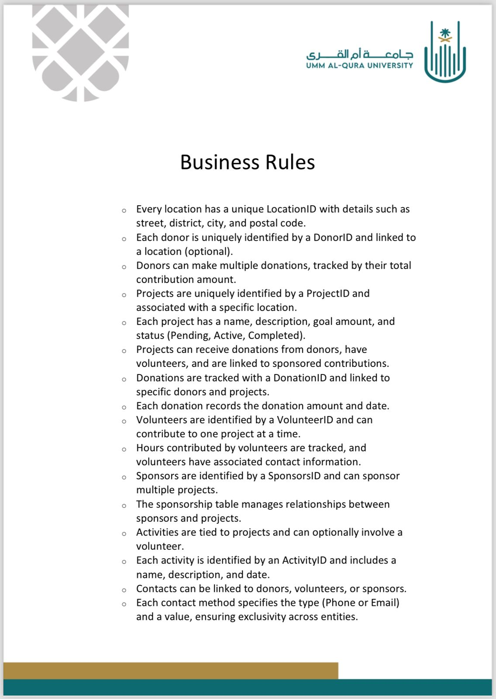
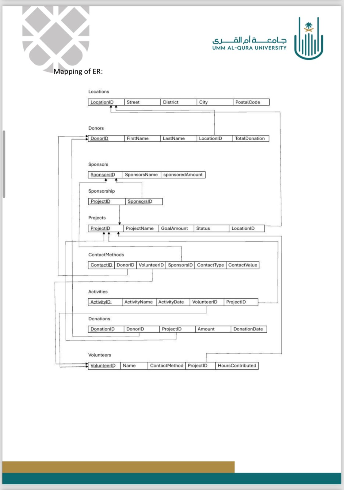
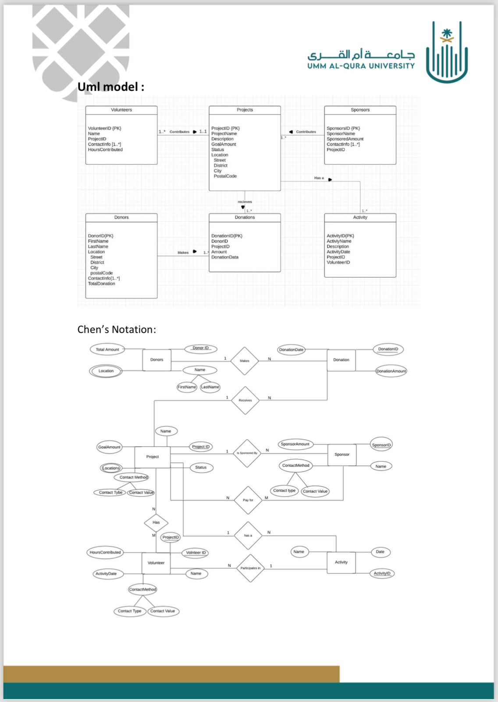

## Business Rules

The business rules define the logic that governs the relationships between entities. They help ensure data integrity and organize operations within the database.

---

## Entity-Relationship Diagrams

### 1. Mapping of ER

This diagram shows the relationships between tables using primary and foreign keys. It illustrates how the main entities such as Donors, Projects, Volunteers, Sponsors, and Activities are connected.

### 2. UML Model

This diagram provides a simplified visual representation of the relationships (1:N or N:1) between the main entities using table-based structure.

### 3. Chen’s Notation

This model uses Chen’s symbols to represent the relationships between entities, along with detailed attributes for each entity.

